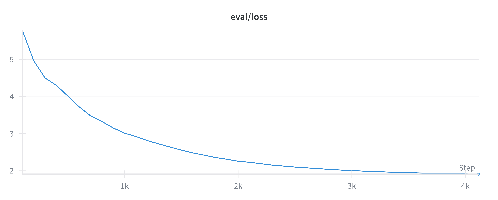

<h1 align="center">LLM: Architecture</h1>
<p align="center"><b>Implement different SOTA LLM Architecture using PyTorch</b></p>

I write a note about corresponding to the code structure, please check [LLM Part1: Architecture](https://yuyang.info/posts/Blogs/LLM/LLM-Architecture/post.html).


<h2 align="center">About This Repository</h2>

This repository implements different SOTA LLM architectures using PyTorch. The current implemented models include:
- Position Encoding:
  - Learned Positional Encoding
  - Sinusoidal Positional Encoding
  - Relative Positional Encoding 
  - Rotary Positional Encoding (RoPE)
- Attention Mechanisms:
  - Standard Multi-Head Attention
  - Multi-Query Attention / Grouped-Query Attention

<h2 align="center">Environment Prepare</h2>
First, clone the repository and navigate into it:

```Shell
git clone https://github.com/YYZhang2025/LLM-Architecture.git
cd LLM-Architecture
```

Then, we need to install dependencies, here we are using `uv`

```Shell
wget -qO- https://astral.sh/uv/install.sh | sh
export PATH="$HOME/.local/bin:$PATH"
uv --version

uv sync 
source .venv/bin/activate
uv pip install -e .
```

It will automatically create a virtual environment and install the required dependencies.
And we also need download the `tinystories` dataset through
You have two options:

**Option 1**: Download dataset, and train BPE tokenizer, than tokenize the dataset and save as numpy array. (it might take **20 minutes**)

```Shell
chmod +x download.sh
./download.sh
```

After download the dataset, you can run the `pre_tokenize.py` script to tokenize the dataset and save it as numpy arrays for faster loading during training
```Shell
python pre_tokenize.py
```

**Option 2**: Download the pre-tokenized dataset
```Shell
chmod +x download_tokenized.sh
./download_tokenized.sh
```

After download and processed , you should have following files in the `data` directory:
```Text 
📂 data  
└── 📂 tinystories  
    ├── 📄 tinystories_eval_tokens.npy  
    ├── 📄 tinystories_train_tokens.npy  
    ├── 📘 TinyStoriesV2-GPT4-train.txt  
    ├── 📘 TinyStoriesV2-GPT4-valid.txt  
    └── 🧩 tokenizer-bpe.json  
```


<h2 align="center">BPE Tokenizer</h2>

The BPE tokenizer is implemented using the `tokenizers` library. The tokenizer is trained on the `TinyStoriesV2-GPT4` dataset with a vocabulary size of **10,000** tokens. The tokenizer configuration is defined in the `pre_tokenize.py` script.


<h2 align="center">Experiments</h2>

The dataset we are using is [TinyStoriesV2-GPT4](https://huggingface.co/datasets/roneneldan/TinyStories). We have pre-tokenized the dataset and saved it as numpy arrays for faster loading during training. The tokenizer used is a BPE tokenizer trained using the `tokenizers` library. For the tokenization part, please refer to the `pre_tokenize.py` script.

All the model defined in the `llm/models` directory. 


```Text
📂 llm
├── 📂 models
│   ├── 📂 baseline.py
```

Each model has a corresponding training script in the `train_scripts` directory.
```Text
📂 train_scripts
├── 📄 train_baseline.py
```

The default training and model configuration are defined in the `config.py` file. You can modify the configurations as needed.

```Python
@dataclass
class ModelConfig:
    n_layers: int = 8
    n_heads: int = 16
    d_model: int = 512
    d_ff: int = 2048

    max_seq_len: int = 512
    vocab_size: int = 16_000 # Need to be consistent with the tokenizer


@dataclass
class TrainConfig:
    device: torch.device = torch.device("cpu")

    epochs: int = 2
    micro_batch_size: int = 128
    gradient_accumulation_steps: int = 2
    eval_steps: int = 100

    betas: tuple = (0.9, 0.95)
    grad_clip: float = 1.0
    weight_decay: float = 1e-2
    max_lr: float = 5e-4
    min_lr: float = 5e-5
    warmup_steps: int = 100
```

>[!TIP]
> You can monitor the GPU usage using `uvx nvitop` command in another terminal.

<h3 align="center">Baseline Model</h3>

Total training time: 95.49 minutes

The baseline model is defined in `./llm/models/baseline.py`

- Sinusoidal Positional Encoding
- RMSNorm
  - Pre-Norm
- Standard Multi-Head Attention
- Feed Forward Network

You can train the baseline model using the following command:

```Shell
python train_scripts/train_baseline.py 
```

Below is the training and evaluation loss curve for the baseline model:





<h3 align="center">Model with Grouped Query Attention</h3>
The grouped query attention model is defined in `./llm/models/gqa.py`

- Sinusoidal Positional Encoding
- RMSNorm
  - Pre-Norm
- Grouped Query Attention / Multi-Query Attention
- Feed Forward Network
  
Train the grouped query attention model using the following command:

```Shell
python train_scripts/train_gqa.py 
```

Below is the training and evaluation loss curve for the GQA model:


The grouped query attention model achieves similar performance as the baseline model, but with reduced training time and memory usage. This demonstrates the efficiency of the grouped query attention mechanism.


<h3 align="center">Model with Rotary Positional Encoding</h3>
The rotary positional encoding model is defined in `./llm/models/rope.py`

- Rotary Positional Encoding
- RMSNorm
  - Pre-Norm
- Grouped Query Attention / Multi-Query Attention
- Feed Forward Network

Train the rotary positional encoding model using the following command:

```Shell
python train_scripts/train_rope.py
```

Below is the training and evaluation loss curve for the Rotary Positional Encoding model: